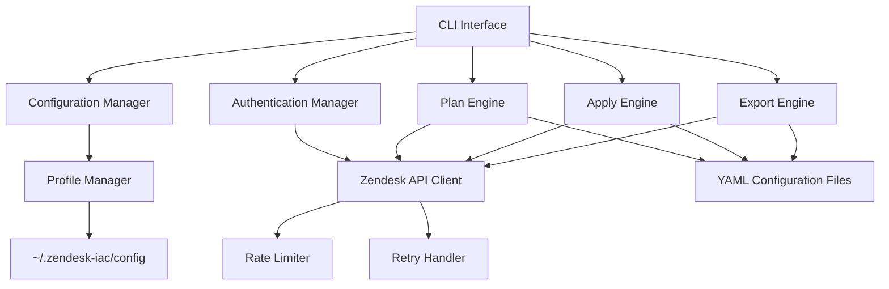

# 設計文書

## 概要

Zendesk IaC管理ツールは、YAMLファイルでZendeskの設定を定義し、Infrastructure as Codeの原則に従って設定を管理するCLIツールです。このツールは、複数環境の管理、安全なデプロイメント、既存設定のエクスポート機能を提供します。

## アーキテクチャ

### 全体アーキテクチャ



### レイヤー構成

1. **CLI Layer**: ユーザーインターフェース層
2. **Business Logic Layer**: コア機能の実装層
3. **API Client Layer**: Zendesk API通信層
4. **Configuration Layer**: 設定管理層

## コンポーネントと インターフェース

### 1. CLI Interface

**責任**: ユーザーコマンドの受付と結果表示

**主要コマンド**:
- `zendesk-iac plan [--profile <profile>]`: 変更計画の表示
- `zendesk-iac apply [--profile <profile>]`: 設定の適用
- `zendesk-iac export [--profile <profile>] [--output <dir>]`: 設定のエクスポート
- `zendesk-iac validate`: 設定ファイルの検証

**インターフェース**:
```typescript
interface CLICommand {
  execute(args: CommandArgs): Promise<CommandResult>
  validate(args: CommandArgs): ValidationResult
}
```

### 2. Configuration Manager

**責任**: YAML設定ファイルの読み込み、検証、パース

**サポート対象**:
- チケットフィールド (ticket_fields)
- ユーザーフィールド (user_fields)
- 組織 (organizations)
- グループ (groups)
- マクロ (macros)
- トリガー (triggers)
- 自動化 (automations)

**設定ファイル構造例**:
```yaml
# zendesk-config.yml
ticket_fields:
  - title: "Priority Level"
    type: "dropdown"
    options:
      - "Low"
      - "Medium"
      - "High"
    required: true

triggers:
  - title: "Auto-assign to support team"
    conditions:
      - field: "status"
        operator: "is"
        value: "new"
    actions:
      - field: "assignee_id"
        value: "123456"
```

### 3. Authentication Manager

**責任**: プロファイル管理とAPI認証

**プロファイル設定ファイル** (`~/.zendesk-iac/config`):
```ini
[profile dev]
subdomain = yourcompany-dev
email = dev-admin@yourcompany.com
api_token = dev_api_token

[profile prod]
subdomain = yourcompany
email = prod-admin@yourcompany.com
api_token = prod_api_token
```

**インターフェース**:
```typescript
interface AuthenticationManager {
  loadProfile(profileName: string): Profile
  validateCredentials(profile: Profile): Promise<boolean>
  getApiClient(profile: Profile): ZendeskApiClient
}
```

### 4. Zendesk API Client

**責任**: Zendesk REST APIとの通信

**主要機能**:
- API Token認証
- レート制限の遵守
- 自動リトライ機能
- プラン検知とレート制限調整

**サポートAPI エンドポイント**:
- `/api/v2/ticket_fields`
- `/api/v2/user_fields`
- `/api/v2/organizations`
- `/api/v2/groups`
- `/api/v2/macros`
- `/api/v2/triggers`
- `/api/v2/automations`

### 5. Plan Engine

**責任**: 現在の状態と望ましい状態の差分計算

**機能**:
- 現在のZendesk設定の取得
- YAML設定との差分計算
- 変更計画の生成と表示

**出力例**:
```
Plan: 3 to add, 1 to change, 0 to destroy.

+ ticket_fields.priority_level
  + title: "Priority Level"
  + type: "dropdown"
  + options: ["Low", "Medium", "High"]

~ triggers.auto_assign
  ~ conditions[0].value: "open" -> "new"
```

### 6. Apply Engine

**責任**: 変更の安全な適用

**安全機能**:
- サブドメイン表示と確認
- 破壊的変更の警告
- ユーザー同意の取得
- ロールバック機能

**適用フロー**:
1. プラン生成
2. サブドメイン表示
3. ユーザー確認
4. 段階的適用
5. 結果レポート

### 7. Export Engine

**責任**: 既存Zendesk設定のYAMLエクスポート

**機能**:
- 全設定の一括エクスポート
- 設定タイプ別エクスポート
- ファイル構造の自動生成

## データモデル

### Configuration Schema

```typescript
interface ZendeskConfiguration {
  ticket_fields?: TicketField[]
  user_fields?: UserField[]
  organizations?: Organization[]
  groups?: Group[]
  macros?: Macro[]
  triggers?: Trigger[]
  automations?: Automation[]
}

interface TicketField {
  title: string
  type: 'text' | 'textarea' | 'dropdown' | 'checkbox' | 'date' | 'integer' | 'decimal' | 'regexp'
  description?: string
  required?: boolean
  options?: string[]
  regexp_for_validation?: string
}

interface Trigger {
  title: string
  description?: string
  conditions: Condition[]
  actions: Action[]
  active?: boolean
}
```

### Profile Model

```typescript
interface Profile {
  name: string
  subdomain: string
  email: string
  api_token: string
}
```

## エラーハンドリング

### エラー分類

1. **設定エラー**: YAML構文エラー、スキーマ検証エラー
2. **認証エラー**: 無効なAPI Token、権限不足
3. **API エラー**: レート制限、ネットワークエラー、サーバーエラー
4. **ビジネスロジックエラー**: 設定競合、依存関係エラー

### エラー処理戦略

- **Graceful Degradation**: 部分的な失敗でも可能な限り処理を継続
- **Detailed Logging**: エラーの詳細情報とスタックトレースの記録
- **User-Friendly Messages**: 技術的でない明確なエラーメッセージ
- **Recovery Suggestions**: エラー解決のための具体的な提案

### レート制限処理

```typescript
interface RateLimiter {
  checkLimit(endpoint: string): Promise<boolean>
  waitForReset(endpoint: string): Promise<void>
  adjustRetryInterval(planType: ZendeskPlan): void
}

enum ZendeskPlan {
  ESSENTIAL = 'essential',
  TEAM = 'team', 
  PROFESSIONAL = 'professional',
  ENTERPRISE = 'enterprise',
  ENTERPRISE_PLUS = 'enterprise_plus'
}
```

## テスト戦略

### 単体テスト
- 各コンポーネントの独立したテスト
- モックを使用したAPI呼び出しのテスト
- 設定ファイルのパースとバリデーションテスト

### 統合テスト
- Zendesk API との実際の通信テスト
- エンドツーエンドのワークフローテスト
- 複数環境での動作確認

### テストデータ
- サンドボックス環境での安全なテスト
- テスト用のZendeskインスタンス使用
- モックデータによる単体テスト

### テスト自動化
- CI/CDパイプラインでの自動テスト実行
- プルリクエスト時の自動検証
- リグレッションテストの継続実行